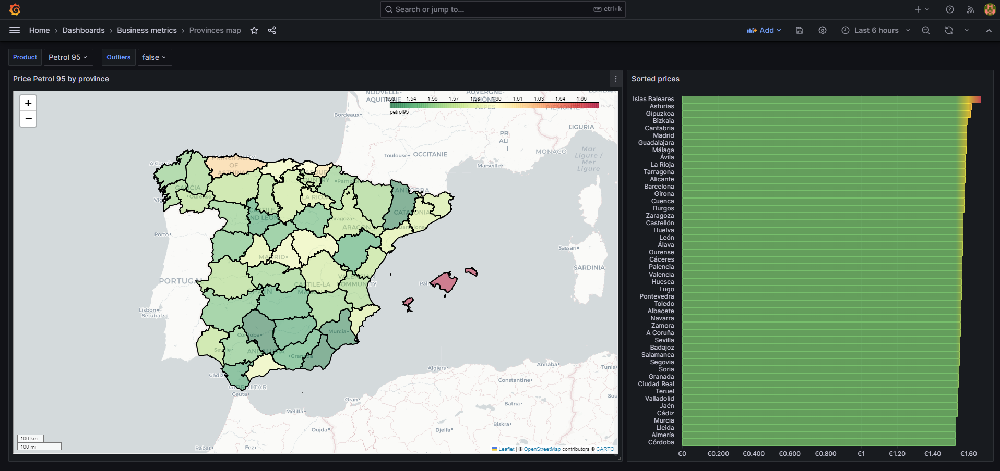
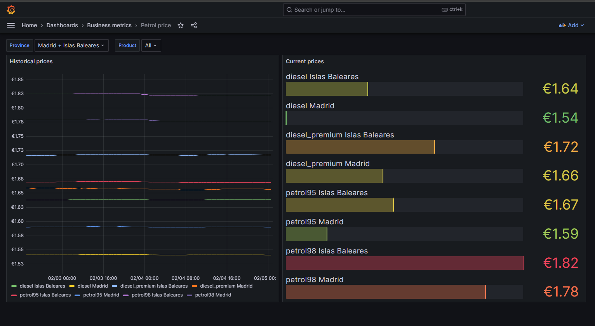
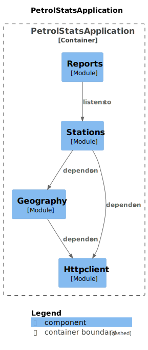

# Petrol stats
The project aims to explore how petrol prices fluctuate based on
geographical zones. Prices for each petrol station are publicly available,
shared by the government through a REST API.

The processing logic for the information is managed within a Java Spring Boot
application. This application communicates with the reports service using
RabbitMQ. Every 30 minutes, based on the Government API, new prices trigger 
the publication of a message to inform consumers.

A Python service is in place to generate reports, specifically prices by
province maps. This service actively listens for messages and generates
new reports each time an update occurs

## Grafana

[Login Grafana](https://8kfsh5qfv5.execute-api.eu-west-1.amazonaws.com/) - Credentials: guest/guest

## Diagrams

